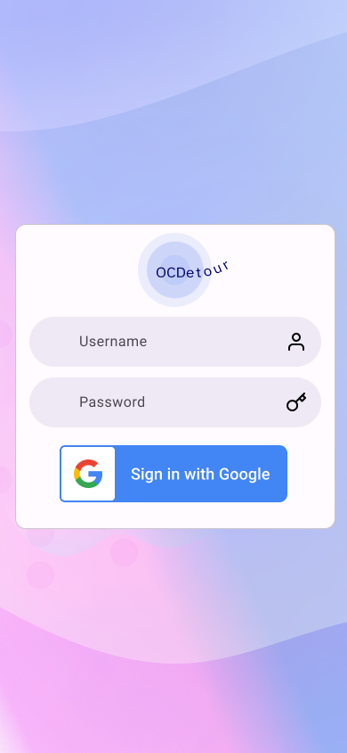
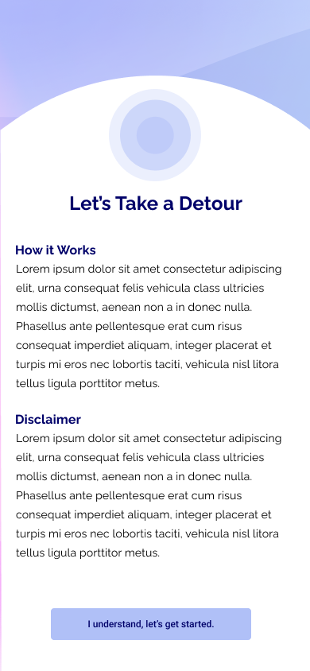
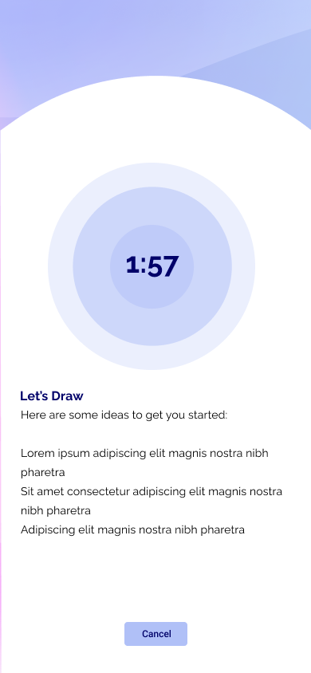

# OCDetour

## Description

OCDetour is an app to help delay compulsions for people with OCD. Leveraging [research published in the journal of Behavioral Analysis](https://www.ncbi.nlm.nih.gov/pmc/articles/PMC6758933/), OCDetour utilizes the concept of delay discounting. By delaying a compulsion, the perceived reward value of completing the compulsion decreases. With OCDetour, the user can select from a list of Detours -- activities that encourage the user to do something else for a set amount of time -- and delay compulsions.

## Mockups

## Installation & Dependencies

Install with `npm i`
Run client and server with `npm run develop`

### Resources Used

[https://unsplash.com/photos/s3tPywNsLSo](https://unsplash.com/photos/s3tPywNsLSo)

[https://unsplash.com/photos/01_igFr7hd4](https://unsplash.com/photos/01_igFr7hd4)

[https://unsplash.com/photos/3ZvHsFiZyME](https://unsplash.com/photos/3ZvHsFiZyME)
