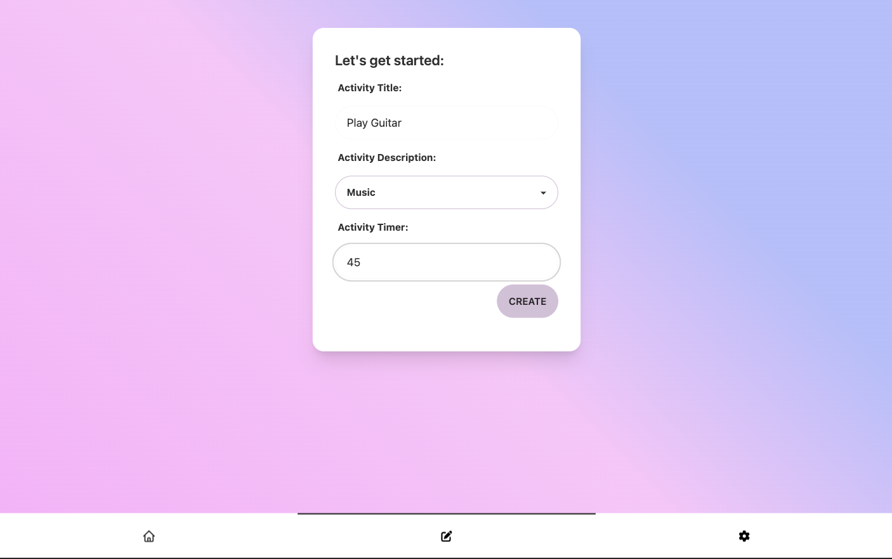
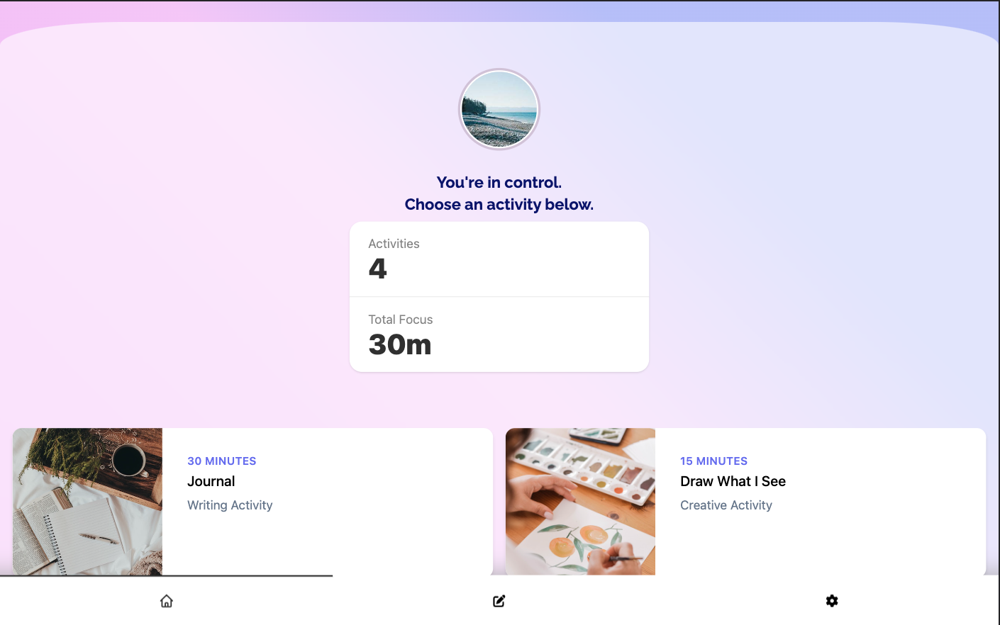

# OCDetour

## Description

OCDetour is an app to help delay compulsions for people with OCD. Leveraging [research published in the journal of Behavioral Analysis](https://www.ncbi.nlm.nih.gov/pmc/articles/PMC6758933/), OCDetour utilizes the concept of delay discounting. By delaying a compulsion, the _perceived reward value_ of completing the compulsion decreases. With OCDetour, the user can select from a list of Detours -- activities that encourage the user to do something else for a set amount of time -- and delay compulsions.

This application uses the following technologies:

React Library
**Mongoose** for data housing.
**Apollo/GraphQL** for remote data management.
**JWT** for authentication and security.
**Tailwind CSS with DaisyUI** for design.

## Table of Contents

- [OCDetour](#ocdetour)
    - [Description](#description)
- [Table of Contents](#table-of-contents)
    - [Links](#links)
    - [Preview](#preview)
        -[Login Page](#login-page)
        -[Create Activity Page](#create-activity-page)
        -[Activity Page](#activity-page)
    - [Installation & Dependencies](#installation--dependencies)
    - [Development Team](#development-team)
        -[Tina Croxton](#tina-croxton)
        -[Victoria McNorrill](#victoria-mcnorrill)
        -[John Kersey](#john-kersey)
        -[Nick Johnson](#nick-johnson)
    - [License](#license)
    - [Node Dependencies](#node-dependencies)
    - [Disclaimer](#disclaimer)
    - [Resources Used](#resources-used)

## Links

[Deployed Application]()

## Preview

### Login Page

### Create Activity Page

### Activity Page

## Installation & Dependencies

1. Install with `npm run install`.
2. Seed the server with `cd server`, `npm run seed`, then `cd ..`
3. Run client and server with `npm run develop`.

## Development Team

# Tina Croxton

*Database Administrator, API Developer* 

[GitHub Profile](https://github.com/TinaTheDev91)

# Victoria McNorrill

*UI/UX Designer, Front-End Developer*

[Github Profile](https://github.com/victoriamcn)

# John Kersey

*Authentication Engineer*

[Github Profile](https://github.com/JohnKersey2)

# Nick Johnson

*UI/UX Designer, Front-End Developer*

[Github Profile](https://github.com/jsnicholas)

## License

[MIT](https://img.shields.io/badge/License-MIT-blue.svg)
This project is licensed under MIT.

- [Click](https://pitt.libguides.com/openlicensing/MIT#:~:text=Users%20of%20software%20using%20an,and%20the%20X%20Windows%20System.) here to view the license documentation.

## Node Dependencies

Click links to read the documentation for each dependency:

- [@apollo/client](https://www.npmjs.com/package/@apollo/client)
- [bcrypt](https://www.npmjs.com/package/bcrypt)
- [express](https://www.npmjs.com/package/express)
- [graphql](https://www.npmjs.com/package/graphql)
- [GraphQL-scalars](https://www.npmjs.com/package/graphql-scalars)
- [jsonwebtoken](https://www.npmjs.com/package/jsonwebtoken)
- [mongoose](https://www.npmjs.com/package/mongoose)
- [react](https://www.npmjs.com/package/react)

## Disclaimer

OCDetour is an app designed to provide support and information for individuals dealing with obsessive-compulsive disorder (OCD). However, it is important to note that OCDetour is not intended to replace professional medical advice, diagnosis, or treatment. The content provided in this app is for informational purposes only and should not be considered a substitute for professional medical guidance.

### Resources Used

FontAwesome icons
